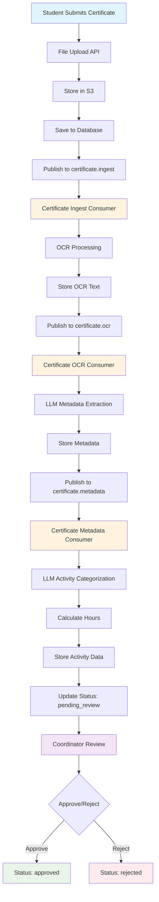
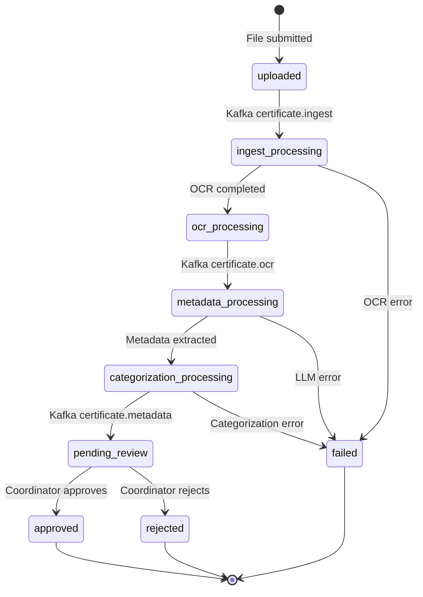

# OCR Certificate Processing Service

An advanced certificate processing service that performs OCR text extraction, metadata extraction, and activity categorization using LLM technology with asynchronous Kafka-based processing pipeline.

## Features

### Core Functionality
- **OCR Text Extraction**: Extract text from PDF, PNG, JPG, and other image formats using Tesseract
- **LLM-based Metadata Extraction**: Extract structured information (participant name, event name, hours, etc.) using Ollama LLM
- **Smart Activity Categorization**: Automatically categorize activities using AI and calculate equivalent hours based on institutional rules
- **Asynchronous Processing**: Scalable pipeline using Apache Kafka streams for async document processing
- **S3 Storage**: Store documents in S3-compatible storage (LocalStack for development)
- **Coordinator Review Workflow**: Human oversight process for approval/rejection of processing results
- **Duplicate Detection**: Prevent reprocessing of identical files using SHA-256 checksum validation
- **Student Management**: Student registration and submission tracking

### Modern Architecture
- **REST API**: Flask-based REST API with dependency injection and repository patterns
- **Kafka Streams**: Event-driven async pipeline with three specialized consumers
- **Database**: PostgreSQL with comprehensive schema and relationship management
- **Storage**: S3-compatible storage with enrollment-based file organization
- **Containerized**: Full Docker Compose setup with automatic model downloading
- **Repository Pattern**: Clean architecture with proper separation of concerns

## Document Processing Flow



## Status Flow Diagram



## Quick Start

### Prerequisites
- Docker and Docker Compose
- WSL2 (if on Windows)

### 1. Start All Services
```bash
docker-compose up -d
```

This will start:
- **PostgreSQL** (port 5434): Database with activity categories and submission tracking
- **Ollama** (port 11434): LLM service with automatic llama3.2:3b model download
- **LocalStack** (port 4566): S3-compatible storage for certificate files
- **Kafka** (port 9092): Message streaming with KRaft (no Zookeeper needed)
- **Flask API** (port 5000): Main REST API application
- **Kafka Consumers**: Three specialized async processors:
  - Certificate Ingest Consumer (OCR processing)
  - Certificate OCR Consumer (metadata extraction)
  - Certificate Metadata Consumer (activity categorization)

### 2. Verify Services
Check that all services are healthy:
```bash
# Check API health
curl http://localhost:5000/api/v1/health

# Check Ollama model download
docker-compose logs ollama

# Check Kafka topics
docker-compose exec kafka kafka-topics.sh --list --bootstrap-server localhost:9092

# Check consumer logs
docker-compose logs ocr-kafka-consumers
```

## Architecture Overview

### Kafka Stream Processing

The system uses Apache Kafka for asynchronous document processing with three specialized consumers:

#### 1. Certificate Ingest Consumer (`certificate.ingest`)
- **Purpose**: OCR text extraction from uploaded documents
- **Input**: File upload events with S3 path and submission metadata
- **Processing**: 
  - Download file from S3
  - Extract text using Tesseract OCR
  - Store raw OCR text in database
  - Update submission status to `ocr_processing`
- **Output**: Publishes to `certificate.ocr` topic

#### 2. Certificate OCR Consumer (`certificate.ocr`)
- **Purpose**: Metadata extraction using LLM
- **Input**: OCR completion events with extracted text
- **Processing**:
  - Send OCR text to Ollama LLM
  - Extract structured metadata (participant name, event, location, date, hours)
  - Store metadata in database
  - Update submission status to `metadata_processing`
- **Output**: Publishes to `certificate.metadata` topic

#### 3. Certificate Metadata Consumer (`certificate.metadata`)
- **Purpose**: Activity categorization and hours calculation
- **Input**: Metadata extraction completion events
- **Processing**:
  - Load activity categories from database
  - Use LLM to categorize activity type
  - Calculate valid hours based on category rules
  - Store extracted activity data
  - Update submission status to `pending_review`
- **Output**: Ready for coordinator review

### Database Schema

```sql
-- Core entities
students                    -- Student registration
certificate_submissions     -- File uploads and status tracking
certificate_ocr_text        -- Raw OCR extracted text (1:1 with submissions)
certificate_metadata        -- LLM extracted metadata
activity_categories         -- Predefined activity types and calculation rules
extracted_activities        -- Final categorized activities with calculated hours
```

### Technology Stack

- **Backend**: Python Flask with dependency injection
- **Database**: PostgreSQL with SQLAlchemy ORM
- **Message Queue**: Apache Kafka with KRaft
- **LLM**: Ollama (llama3.2:3b model)
- **OCR**: Tesseract
- **Storage**: S3 (LocalStack for development)
- **Architecture**: Repository pattern with service layer

## API Endpoints

### Student Management

#### Register Student
```bash
POST /api/v1/student/register
Content-Type: application/json

{
    "enrollment_number": "12345678",
    "name": "John Doe",
    "email": "john.doe@student.edu"
}
```

#### Update Student
```bash
PUT /api/v1/student/update
Content-Type: application/json

{
    "enrollment_number": "12345678",
    "name": "John Doe Updated",
    "email": "john.updated@student.edu"
}
```

#### Get Student Data
```bash
GET /api/v1/student/get/12345678
```

### Certificate Submission (Async Processing)

#### Submit Certificate for Processing
```bash
POST /api/v1/certificate/submit
Content-Type: multipart/form-data

# Form data:
# - file: Certificate file (PDF, PNG, JPG, etc.)
# - enrollment_number: Student enrollment number
```

**Response:**
```json
{
    "success": true,
    "submission_id": 123,
    "message": "Certificate submitted successfully for async processing",
    "s3_path": "certificates/12345678/abc123.pdf",
    "status": "uploaded"
}
```

#### Get Student Submissions
```bash
GET /api/v1/student/submissions/12345678
```

**Response:**
```json
{
    "submissions": [
        {
            "id": 123,
            "original_filename": "certificate.pdf",
            "status": "pending_review",
            "submitted_at": "2023-10-16T10:30:00Z",
            "file_size": 2048576,
            "processing_stages": {
                "ocr_completed": true,
                "metadata_extracted": true,
                "categorization_completed": true
            }
        }
    ]
}
```

### Coordinator Review

#### Get Pending Submissions
```bash
GET /api/v1/coordinator/pending
```

**Response:**
```json
{
    "submissions": [
        {
            "submission_id": 123,
            "student_name": "John Doe",
            "enrollment_number": "12345678",
            "original_filename": "certificate.pdf",
            "submitted_at": "2023-10-16T10:30:00Z",
            "status": "pending_review",
            "metadata": {
                "event_name": "Programming Workshop",
                "participant_name": "John Doe",
                "location": "University Campus",
                "event_date": "2023-10-01",
                "original_hours": "20 horas",
                "numeric_hours": 20
            },
            "extracted_activity": {
                "category_name": "Technical Course Participation",
                "calculated_hours": 20,
                "llm_reasoning": "Workshop identified as technical learning activity..."
            }
        }
    ]
}
```

#### Get Submission Details
```bash
GET /api/v1/coordinator/submission/{submission_id}
```

#### Approve Submission
```bash
POST /api/v1/coordinator/approve/{submission_id}
Content-Type: application/json

{
    "approved_hours": 20,
    "coordinator_notes": "Certificate validated and approved"
}
```

#### Reject Submission
```bash
POST /api/v1/coordinator/reject/{submission_id}
Content-Type: application/json

{
    "rejection_reason": "Certificate does not meet course requirements",
    "coordinator_notes": "Event not related to computer engineering"
}
```

### System Health

#### Check API Health
```bash
GET /api/v1/health
```

**Response:**
```json
{
    "status": "healthy",
    "timestamp": "2023-10-16T10:30:00Z",
    "services": {
        "database": "connected",
        "kafka": "connected",
        "ollama": "available",
        "s3": "connected"
    }
}
```

## Development

### Local Development Setup

1. **Clone the repository**
```bash
git clone <repository-url>
cd ocr
```

2. **Environment Configuration**
```bash
# Copy environment template
cp .env.example .env

# Edit configuration as needed
nano .env
```

3. **Start development services**
```bash
# Start infrastructure (DB, Kafka, Ollama, S3)
docker-compose up -d postgres kafka ollama localstack

# Wait for Ollama model download
docker-compose logs -f ollama

# Start consumers in development mode
docker-compose up ocr-kafka-consumers

# Start Flask API (in another terminal)
python main.py
```

### Performance Tuning

#### Kafka Configuration
- Adjust `KAFKA_NUM_PARTITIONS` for better parallelism
- Tune consumer `batch.size` and `fetch.min.bytes`
- Monitor consumer lag and throughput

#### Ollama Optimization
- Increase `OLLAMA_TIMEOUT` for complex documents
- Consider GPU acceleration for faster LLM processing
- Adjust model temperature and top_p for consistency

#### Database Optimization
- Add indexes for frequently queried fields
- Monitor query performance with `EXPLAIN ANALYZE`
- Consider connection pooling for high load

## Project Structure

```
ocr/
├── main.py                          # Flask application entry point
├── consumer_manager.py              # Kafka consumer orchestrator
├── docker-compose.yml              # Full service orchestration
├── requirements.txt                 # Python dependencies
├── database/
│   ├── __init__.py                 # Database configuration
│   ├── connection.py               # Session management
│   └── init.sql                    # Database schema
├── models/                         # SQLAlchemy ORM models
│   ├── student.py                  # Student entity
│   ├── certificate_submission.py   # File submission tracking
│   ├── certificate_ocr_text.py     # OCR extracted text
│   ├── certificate_metadata.py     # LLM extracted metadata
│   ├── activity_category.py        # Activity classification rules
│   └── extracted_activity.py       # Final categorized activities
├── repositories/                   # Data access layer
│   ├── base_repository.py          # Generic CRUD operations
│   ├── student_repository.py       # Student data access
│   ├── certificate_submission_repository.py
│   ├── certificate_ocr_text_repository.py
│   ├── certificate_metadata_repository.py
│   ├── activity_category_repository.py
│   └── extracted_activity_repository.py
├── services/                       # Business logic layer
│   ├── ocr_service.py              # Tesseract OCR integration
│   ├── llm_service.py              # Ollama LLM integration
│   ├── s3_service.py               # S3 storage operations
│   ├── kafka_service.py            # Kafka messaging
│   ├── prompt_service.py           # LLM prompt management
│   ├── activity_categorization_service.py  # AI categorization
│   ├── certificate_service.py      # Certificate processing
│   ├── certificate_submission_service.py   # Submission workflow
│   └── student_service.py          # Student management
├── consumers/                      # Kafka stream processors
│   ├── certificate_ingest_consumer.py      # OCR processing
│   ├── certificate_ocr_consumer.py         # Metadata extraction
│   └── certificate_metadata_consumer.py    # Activity categorization
├── routes/                         # REST API endpoints
│   ├── health.py                   # Health check endpoints
│   ├── student.py                  # Student management API
│   ├── certificate.py             # Certificate submission API
│   └── coordinator.py             # Review workflow API
└── config/                         # Configuration management
    ├── settings.py                 # Environment configuration
    ├── injection.py                # Dependency injection setup
    └── prompts.py                  # LLM prompt templates
```

## Testing

### API Testing with Bruno

The project includes a comprehensive Bruno API collection for testing all endpoints:

**Collection Location**: `API/OCR Service/`

**Available Test Requests**:
- `Health Check.bru` - Service health verification
- `Student Register.bru` - Student registration
- `Student Update.bru` - Student information update
- `Student Get.bru` - Retrieve student data
- `Student Submissions.bru` - Get student submission history
- `Certificate Submit.bru` - Certificate file submission
- `Certificate Status.bru` - Check submission status
- `Coordinator Pending.bru` - Get pending submissions for review
- `Coordinator Submission Details.bru` - Get detailed submission info
- `Coordinator Approve.bru` - Approve submissions
- `Coordinator Reject.bru` - Reject submissions
- `LLM Generate.bru` - Direct LLM testing

**Running Tests**:

```bash
# Install Bruno CLI
npm install -g @usebruno/cli

# Run entire collection
bru run "API/OCR Service"

# Run specific test
bru run "API/OCR Service/Health Check.bru"

# Run with custom environment
bru run "API/OCR Service" --env local
```

**Using Bruno GUI**:

```bash
# Install Bruno desktop app
# Download from: https://www.usebruno.com/downloads

# Open the collection
# File -> Open Collection -> Select "API/OCR Service" folder
```

**Test Environment Variables**:
- `baseUrl`: http://localhost:5000 (default)
- `enrollmentNumber`: Test student enrollment number
- `submissionId`: Submission ID for testing coordinator workflows

### Manual Testing Workflow

1. **Register a Student**
```bash
curl -X POST http://localhost:5000/api/v1/student/register \
  -H "Content-Type: application/json" \
  -d '{"enrollment_number": "12345678", "name": "Test Student", "email": "test@student.edu"}'
```

2. **Submit a Certificate**
```bash
curl -X POST http://localhost:5000/api/v1/certificate/submit \
  -F "file=@sample_certificate.pdf" \
  -F "enrollment_number=12345678"
```

3. **Monitor Processing**
```bash
# Check submission status
curl http://localhost:5000/api/v1/student/submissions/12345678

# Watch consumer logs
docker-compose logs -f ocr-kafka-consumers
```

4. **Coordinator Review**
```bash
# Get pending submissions
curl http://localhost:5000/api/v1/coordinator/pending
```

```bash
# Approve submission
curl -X POST http://localhost:5000/api/v1/coordinator/approve/1 \
  -H "Content-Type: application/json" \
  -d '{"approved_hours": 20, "coordinator_notes": "Approved"}'
```

```bash
# Reject submission
POST /api/v1/coordinator/reject/{submission_id}
Content-Type: application/json

{
  "reason": "Insufficient documentation of learning outcomes",
  "notes": "Please resubmit with detailed course syllabus"
}
```

## Processing Pipeline

### Async Processing Flow

1. **File Submission**
   - User uploads certificate file with enrollment number
   - File checksum calculated for duplicate detection
   - File uploaded to S3 with enrollment-based path
   - Submission record created in database
   - Message published to `certificate.ingest` Kafka topic

2. **OCR Processing**
   - Ingest consumer downloads file from S3
   - Tesseract performs OCR text extraction
   - OCR results saved to database
   - Message published to `certificate.ocr` topic

3. **Metadata Extraction**
   - OCR consumer processes extracted text with LLM
   - Structured metadata extracted (course, institution, hours, etc.)
   - Metadata saved to database
   - Message published to `certificate.metadata` topic

4. **Activity Categorization**
   - Metadata consumer creates activity description
   - LLM categorizes activity and calculates equivalent hours
   - Activity record created with categorization results
   - Submission marked as "pending_review"

5. **Coordinator Review**
   - Coordinator reviews automatically processed results
   - Can override any extracted values
   - Approves or rejects submission with notes
   - Final approved values stored for reporting

### Kafka Topics

- **certificate.ingest**: New file submissions for OCR processing
- **certificate.ocr**: OCR completed, ready for metadata extraction
- **certificate.metadata**: Metadata extracted, ready for categorization
- **certificate.categorization**: Categorization completed, ready for review

### Database Schema

#### Core Tables
- **students**: Student enrollment information
- **certificate_submissions**: File submissions and processing status
- **certificate_ocr_texts**: OCR extraction results
- **certificate_metadata**: Extracted metadata with coordinator overrides
- **extracted_activities**: Activity categorization with final approved values

#### Status Flow
1. `uploaded` → `queued` → `ocr_processing`
2. `ocr_processing` → `metadata_processing`
3. `metadata_processing` → `categorization_processing`
4. `categorization_processing` → `pending_review`
5. `pending_review` → `approved` or `rejected`

## Development

### Project Structure
```
.
├── main.py                    # Flask application entry point
├── consumer_manager.py        # Kafka consumer orchestrator
├── docker-compose.yml        # Multi-service container setup
├── requirements.txt          # Python dependencies
├── config/
│   ├── settings.py           # Configuration management
│   ├── injection.py          # Dependency injection setup
│   └── prompts.py           # LLM prompts for processing
├── database/
│   ├── __init__.py          # Database connection management
│   └── init.sql             # Database schema
├── models/
│   └── __init__.py          # SQLAlchemy models
├── routes/
│   ├── certificate.py       # Certificate processing endpoints
│   ├── coordinator.py       # Coordinator review endpoints
│   └── health.py            # Health check endpoints
├── services/
│   ├── ocr_service.py       # Tesseract OCR integration
│   ├── llm_service.py       # Ollama LLM integration
│   ├── s3_service.py        # S3 storage operations
│   ├── kafka_service.py     # Kafka message publishing
│   ├── kafka_consumers.py   # Kafka stream processors
│   └── certificate_service.py # Legacy sync processing
└── API/                     # Bruno API collection for testing
```

### Local Development Setup

1. **Clone and Start Services**
```bash
git clone <repository>
cd ocr
docker-compose up -d
```

2. **Monitor Logs**
```bash
# API logs
docker-compose logs -f flask-app

# Consumer logs
docker-compose logs -f kafka-consumers

# All services
docker-compose logs -f
```

3. **Database Access**
```bash
# Connect to PostgreSQL
docker-compose exec postgres psql -U complementa_user -d complementa_db

# View tables
\dt

# Check submissions
SELECT * FROM certificate_submissions ORDER BY submitted_at DESC LIMIT 10;
```

4. **S3 Storage Access**
```bash
# LocalStack S3 endpoint
aws --endpoint-url=http://localhost:4566 s3 ls s3://certificate-documents/

# View files for specific enrollment
aws --endpoint-url=http://localhost:4566 s3 ls s3://certificate-documents/enrollment_12345678/
```

### Configuration

Key environment variables (set in docker-compose.yml):

- **Database**: `DATABASE_URL`, `DB_HOST`, `DB_PORT`
- **Ollama**: `OLLAMA_BASE_URL`, `OLLAMA_MODEL`
- **Kafka**: `KAFKA_BOOTSTRAP_SERVERS`
- **S3**: `S3_ENDPOINT_URL`, `S3_BUCKET_NAME`

### Testing

### Complete Testing Workflow

**Prerequisites**: Ensure all services are running (`docker-compose up -d`)

**Using Bruno Collection** (Recommended):

1. **Open Bruno Collection**: Load `API/OCR Service/` in Bruno GUI or CLI
2. **Run Health Check**: Verify all services are operational
3. **Execute Full Workflow**:
   - Register a student (`Student Register.bru`)
   - Submit a certificate (`Certificate Submit.bru`)
   - Monitor processing status (`Certificate Status.bru`)
   - Review as coordinator (`Coordinator Pending.bru`)
   - Approve/reject submission (`Coordinator Approve.bru` or `Coordinator Reject.bru`)

**Manual cURL Testing**:

## Production Deployment

### Infrastructure Requirements

- **Kafka Cluster**: Replace single Kafka instance with proper cluster
- **S3 Storage**: Replace LocalStack with AWS S3 or compatible service
- **Database**: PostgreSQL with appropriate sizing and backup strategy
- **Load Balancer**: For Flask API instances
- **Monitoring**: Implement proper logging, metrics, and alerting

### Scaling Considerations

- **API Scaling**: Run multiple Flask instances behind load balancer
- **Consumer Scaling**: Increase Kafka consumer instances for higher throughput
- **Database**: Connection pooling and read replicas for heavy workloads
- **Storage**: S3 with appropriate lifecycle policies for cost optimization

### Security

- **Authentication**: Implement proper API authentication
- **Authorization**: Role-based access for coordinator endpoints
- **File Validation**: Enhanced file type and content validation
- **Network Security**: Proper VPC and security group configuration
- **Encryption**: Enable encryption at rest and in transit

## Troubleshooting

### Common Issues

1. **Ollama Model Download**
   - Check logs: `docker-compose logs ollama`
   - Manual pull: `docker-compose exec ollama ollama pull llama3.2:3b`

2. **Kafka Connection Issues**
   - Verify Kafka is running: `docker-compose ps kafka`
   - Check topics: `docker-compose exec kafka kafka-topics.sh --list --bootstrap-server localhost:9092`

3. **Database Connection**
   - Check PostgreSQL: `docker-compose ps postgres`
   - Test connection: `docker-compose exec postgres pg_isready`

4. **S3 Storage Issues**
   - Verify LocalStack: `curl http://localhost:4566/health`
   - Check bucket: `aws --endpoint-url=http://localhost:4566 s3 ls`

### Monitoring

- **API Health**: `GET /api/v1/health`
- **Database Status**: Check submission statuses and error messages
- **Consumer Logs**: Monitor Kafka consumer processing
- **Resource Usage**: Docker stats for container resource usage

## Contributing

1. Fork the repository
2. Create feature branch
3. Add tests for new functionality
4. Update documentation
5. Submit pull request

## License

This project is licensed under the MIT License.